# Desarrollando aplicaciones Spring Boot con Kotlin: Un análisis en profundidad

<!-- TOC -->
- [Desarrollando aplicaciones Spring Boot con Kotlin: Un análisis en profundidad](#desarrollando-aplicaciones-spring-boot-con-kotlin-un-análisis-en-profundidad)
  - [Porque Spring-Boot + Kotlin](#porque-spring-boot--kotlin)
  - [Playground Project: Customer/Kustomer API with JPA](#playground-project-customerkustomer-api-with-jpa)
    - [Stack Tecnologico](#stack-tecnologico)
    - [API-First con OpenAPI Generator](#api-first-con-openapi-generator)
    - [Procesador de anotaciones y MapStruct](#procesador-de-anotaciones-y-mapstruct)
    - [API-First con AsyncAPI (ZenWave SDK)](#api-first-con-asyncapi-zenwave-sdk)
    - [Serialización de eventos con Avro](#serialización-de-eventos-con-avro)
  - [Proyecto Playground: Modelo y Funcionalidad](#proyecto-playground-modelo-y-funcionalidad)
    - [Ejecución](#ejecución)
    - [APIs Publicas](#apis-publicas)
  - [Comparación Java - Kotlin](#comparación-java---kotlin)
    - [Data Classes vs Lombok](#data-classes-vs-lombok)
    - [Objetos de Datos y Getters/Setters](#objetos-de-datos-y-getterssetters)
    - [Java Records: Solución deficiente al problema de los getters/setters](#java-records-solución-deficiente-al-problema-de-los-getterssetters)
    - [Data Classes en Kotlin: La alternativa a Lombok y Java Records](#data-classes-en-kotlin-la-alternativa-a-lombok-y-java-records)
      - [Domain Entity con JPA and Lombok en Java](#domain-entity-con-jpa-and-lombok-en-java)
      - [Domain Entity con Data Classes and JPA en Kotlin](#domain-entity-con-data-classes-and-jpa-en-kotlin)
      - [Poblando Objetos en Java](#poblando-objetos-en-java)
      - [Poblando Objetos en Kotlin](#poblando-objetos-en-kotlin)
        - [Opción 1: Setters](#opción-1-setters)
        - [Opción 2: Funcion APPLY](#opción-2-funcion-apply)
        - [Opción 3: Constructor/Builder](#opción-3-constructorbuilder)
      - [Poblando Records de Java](#poblando-records-de-java)
    - [Java Optional vs Kotlin Null Safety](#java-optional-vs-kotlin-null-safety)
    - [Optional fluid APIs vs Kotlin fluid APIs](#optional-fluid-apis-vs-kotlin-fluid-apis)
    - [API Colecciones/Streams Java vs Kotlin](#api-coleccionesstreams-java-vs-kotlin)
      - [Ejemplo en Kotlin](#ejemplo-en-kotlin)
      - [Ejemplo equivalente en Java](#ejemplo-equivalente-en-java)
    - [Interpolación de Strings y Text Blocks](#interpolación-de-strings-y-text-blocks)
      - [Interpolación de Strings en Java 24](#interpolación-de-strings-en-java-24)
  - [Conclusiones](#conclusiones)
<!-- TOC -->

## Porque Spring-Boot + Kotlin

Aunque versiones recientes de Java han incorporado mejoras significativas en elegancia, expresividad y concisión (como *records*, *pattern matching*, *sealed classes*, *text blocks* y expresiones *switch* mejoradas), Kotlin destaca por ofrecer una sintaxis más limpia, concisa y expresiva. Esto reduce enormemente el código repetitivo (*boilerplate code*), a la vez que mantiene una interoperabilidad total con Java, lo que lo convierte en una opción interesante para desarrollar aplicaciones modernas con Spring Boot.

Además, Kotlin ofrece características avanzadas que mejoran la productividad y la seguridad del código:

- **Data classes**: Simplifican la creación de clases para modelar datos, reduciendo drásticamente el código repetitivo al generar automáticamente _getters/setters_ y métodos como `toString()`, `equals()`, `hashCode()`, eliminando la necesidad de librerías como Lombok.
- **Null safety**: Los tipos son no nulos por defecto, lo que previene errores de tipo `NullPointerException` en tiempo de compilación, fomentando un código más robusto y seguro.
- **Extension functions**: Permiten extender la funcionalidad de clases existentes sin modificar su código fuente ni recurrir a herencia, mejorando la legibilidad y modularidad.
- **Interpolación de Strings**: Similar a las *text blocks* de Java, pero que permite interpolar (sustituir) variables de manera sencilla y natural.
- **Coroutines**: Facilitan la programación asíncrona al permitir escribir código secuencial y claro, eliminando la complejidad de los callbacks o las cadenas de promesas.

Otros puntos fuertes de Kotlin con respecto a Java incluyen su soporte para programación funcional y APIs fluidas:

- **API de Collections/Streams**: Más concisa y expresiva que la API de Collections de Java, con soporte natural para operaciones funcionales como `map`, `filter` y `reduce`.
- **Funciones de orden superior**: Facilitan la modularidad al permitir pasar funciones como argumentos, promoviendo código reutilizable y declarativo.
- **Funciones de alcance (Scoping Functions)**: Como `let`, `apply`, `with`, `run` y `also`, que junto con operadores de *null safety* como `?.` (operador de navegación segura), `?:` (operador Elvis) y `!!` (operador de aserción no nula), permiten encadenar llamadas, crear ámbitos, evitar variables temporales y simplificar el código, haciéndolo más expresivo y fluido.

Todo esto manteniendo la interoperabilidad con Java de manera bidireccional, cualquier código o librería de Java puede ser invocado desde Kotlin y viceversa.

En resumen, Kotlin ofrece una sintaxis más limpia, concisa y expresiva, mejorando la productividad y la seguridad del código, manteniendo la interoperabilidad con Java, lo que lo convierte en una opción interesante para desarrollar aplicaciones modernas con Spring Boot.

Sin embargo cualquier proyecto empresarial Spring-Boot requiere ademas la integracion con herramientas existentes, como generadores de codigo API-First (OpenAPI, AsyncAPI, Avro), procesadores de anotaciones (MapStruct, Lombok), build tools como Maven o Gradle, y otras integraciones que pueden suponer un desafio si no se tiene en cuenta desde el principio.

Por eso en este articulo hemos decidido crear un proyecto sencillo pero no trivial tanto en Java como en Kotlin y asi poder comparar las dos soluciones.

Ademas el proyecto Kotlin se ha configurado para poder ser construido con Gradle o con Maven indistintamente, para poder comparar las dos soluciones.

## Playground Project: Customer/Kustomer API with JPA

Ambos proyectos playground implementan la misma funcionalidad en Java y Kotlin, usando los mismos principios y herramientas, para poder compararlas.

- "Customer with Address and Payment Methods" con JPA en Java: https://github.com/izertis/spring-boot-kotlin-playground/tree/main/customer-address-jpa
- "Kustomer with Address and Payment Methods" con JPA en Kotlin: https://github.com/izertis/spring-boot-kotlin-playground/tree/main/kustomer-address-jpa

### Stack Tecnologico

Hemos elegido un stack tecnologico simple pero completo, que puede servir como base solida para cualquier microservicio empresarial moderno:

- Spring-Boot 3.5.x
- Hibernate
- Spring-Data-JPA
- MapStruct / Lombok
- OpenAPI Generator
- AsyncAPI Generator (ZenWave SDK)
- Avro + Avro Compiler
- Spring-Cloud-Streams
- Spring-Security
- TestContainers con Docker Compose

### API-First con OpenAPI Generator

OpenAPI Generator se utiliza para generar las interfaces anotadas de los controladores de Spring MVC y sus DTOs a partir de una definicion OpenAPI, en un fichero `openapi.yml`.

Podemos configurar el plugin para que genere código en Kotlin (usando el generador [kotlin-spring](https://openapi-generator.tech/docs/generators/kotlin-spring/)) o en Java (generador [spring](https://openapi-generator.tech/docs/generators/spring/)). Ambas implementaciones son equivalentes en tiempo de ejecución, con solo pequeñas diferencias en tiempo de compilacion: esencialmente tipos `null safety` y `ResponseEntity<Unit>` en lugar de `ResponseEntity<Void>` en el caso de Kotlin.

Sin embargo el hecho de generar codigo Kotlin o Java tiene otras implicaciones, ya que en el codigo de Java, este codigo ha de ser compilado para estar disponible desde el codigo Kotlin. Y es muy probable que los DTOs generados por OpenAPI sean referenciados desde las anotaciones de MapStruct en el codigo Kotlin.

Esto tiene implicaciones, como veremos mas adelante, en como se configuran los distintos plugins de build y compilación.

Hemos configurado OpenAPI generator con Maven para ambos proyectos y adicionalmente con Gradle para el proyecto Kotlin:

- OpenAPI Generator con Maven para Java: https://github.com/izertis/spring-boot-kotlin-playground/blob/main/customer-address-jpa/pom.xml#L293
- OpenAPI Generator con Maven para Kotlin: https://github.com/izertis/spring-boot-kotlin-playground/blob/main/kustomer-address-jpa/pom.xml#L312
- OpenAPI Generator con Gradle para Kotlin: https://github.com/izertis/spring-boot-kotlin-playground/blob/main/kustomer-address-jpa/build.gradle.kts#L119

### Procesador de anotaciones y MapStruct

[MapStruct](https://mapstruct.org/) es un procesador de anotaciones de Java que genera automáticamente código para mapear objetos (como DTOs a entidades) usando anotaciones como `@Mapper` y `@Mapping`. Durante el proceso de compilación genera el código Java que implementa dichos mappers, por lo que es eficiente y ligero en tiempo de ejecución.

Aunque podría parecer una elección sencilla, presenta retos importantes para funcionar correctamente en proyectos Kotlin, ya que:

- Lee anotaciones en clases Kotlin
- Que referencian a clases Java generadas por OpenAPI, AsyncAPI o Avro
- Genera código Java
- Que tiene que estar disponible para el resto del código Kotlin

Además, es necesario configurar el procesador de anotaciones para Kotlin **Kapt**, en lugar del procesador de anotaciones de Java.

La configuracion del compilador de Kotlin y el procesador de anotaciones Kapt es probablemente las parte mas critica para garantizar la interoperabilidad entre el codigo Java y Kotlin, escrito a mano y autogenerado por herramientas como OpenAPI Generator, AsyncAPI/ZenWave SDK, Avro Compiler o MapStruct.

- Para Maven: https://github.com/izertis/spring-boot-kotlin-playground/blob/main/kustomer-address-jpa/pom.xml#L210
- Para Gradle:
  - Orden de ejecución de los distintos plugins: https://github.com/izertis/spring-boot-kotlin-playground/blob/main/kustomer-address-jpa/build.gradle.kts#L107
  - Source sets: https://github.com/izertis/spring-boot-kotlin-playground/blob/main/kustomer-address-jpa/build.gradle.kts#L184

### API-First con AsyncAPI (ZenWave SDK)

[ZenWave SDK](https://www.zenwave360.io/zenwave-sdk/plugins/asyncapi-spring-cloud-streams3/) es una herramienta que permite generar, a partir de una definición AsyncAPI, en un fichero `asyncapi.yml`, interfaces Java y sus DTOs para producir y consumir eventos, así como una implementación completa usando Spring Cloud Stream.

Funciona de una manera similar a OpenAPI Generator, pero para AsyncAPI, generando un wrapper muy ligero alrededor de Spring Cloud Stream.

Dado que genera código Java, también es necesario que este código se genere y se compile antes del procesador de anotaciones de MapStruct.

También hemos configurado ZenWave SDK generator con Maven para ambos proyectos y adicionalmente con Gradle para el proyecto Kotlin:

- ZenWave SDK Generator con Maven para Java: https://github.com/izertis/spring-boot-kotlin-playground/blob/main/customer-address-jpa/pom.xml#L343
- ZenWave SDK Generator con Maven para Kotlin: https://github.com/izertis/spring-boot-kotlin-playground/blob/main/kustomer-address-jpa/pom.xml#L363
- ZenWave SDK Generator con Gradle para Kotlin: https://github.com/izertis/spring-boot-kotlin-playground/blob/main/kustomer-address-jpa/build.gradle.kts#L145

Para el caso de Gradle hemos utilizado el plugin de Gradle de JBang que permite ejecutar cualquier CLI o método `main()` de cualquier librería publicada en Maven Central.

### Serialización de eventos con Avro

[Avro](https://avro.apache.org/docs/1.12.0/getting-started-java/) es un formato de serialización de datos, que permite definir esquemas de datos y serializar/deserializar objetos en formato binario. El tamaño de los datos serializados es muy pequeño, y la velocidad de serialización/deserialización es alta en comparación con JSON, y se suele utilizar para serializar eventos en Kafka.

Dado que genera código Java, también es necesario que este código se genere y se compile antes del procesador de anotaciones de MapStruct.

También hemos configurado Avro Compiler con Maven para ambos proyectos y adicionalmente con Gradle para el proyecto Kotlin:

- Avro Compiler con Maven para Java: https://github.com/izertis/spring-boot-kotlin-playground/blob/main/customer-address-jpa/pom.xml#L406
- Avro Compiler con Maven para Kotlin: https://github.com/izertis/spring-boot-kotlin-playground/blob/main/kustomer-address-jpa/pom.xml#L426
- Avro Compiler con Gradle para Kotlin: https://github.com/izertis/spring-boot-kotlin-playground/blob/main/kustomer-address-jpa/build.gradle.kts#L169

**NOTA:** Dado que hasta la versión 1.12.0 de Avro, el orden en que se definen los ficheros de Avro es muy importante para respetar las dependencias entre schemas, hemos decidido utilizar la versión 1.11.1 que es una versión muy extendida para ilustrar esta cuestión.


## Proyecto Playground: Modelo y Funcionalidad

El proyecto de ejemplo es una API REST para gestionar el CRUD del _<<aggregate>>_ Customers, que contiene:

- Una colección de objetos `Address`, que se guardan en BBDD como una columna JSON
- Una colección de objetos `PaymentMethod` gestionada como una relación `OneToMany` con JPA/Hibernate
- Un enum `PaymentMethodType` con un conversor custom para persistir como un entero en BBDD

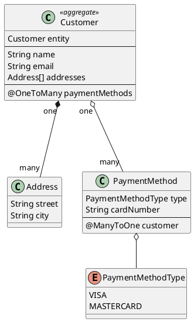
```plantuml
@startuml
class Customer << aggregate >> {
Customer entity
--
String name
String email
Address[] addresses
--
@OneToMany paymentMethods
}

Customer "one" *--down- "many" Address
class Address  {
String street
String city
}

Customer "one" o--down- "many" PaymentMethod
class PaymentMethod  {
PaymentMethodType type
String cardNumber
--
@ManyToOne customer
}

PaymentMethod o-- PaymentMethodType
enum PaymentMethodType  {
VISA
MASTERCARD
}

@enduml
```

- El servicio expone una API REST con los métodos típicos de un CRUD, así como un método de búsqueda paginada.

- Además cada acción de CRUD genera un evento, que se envía a un bus de eventos (Kafka) para ser consumido por otros microservicios.

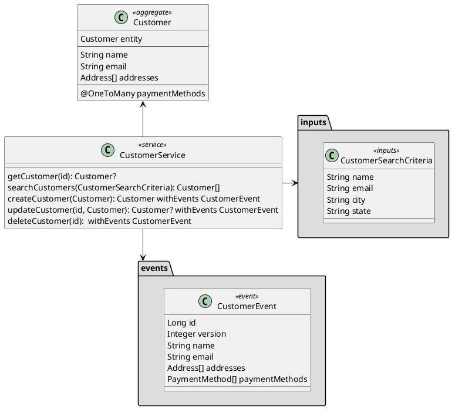
```plantuml
@startuml

CustomerService -up-> Customer
class Customer << aggregate >> {
    Customer entity
    --
    String name
    String email
    Address[] addresses
    --
    @OneToMany paymentMethods
}
class CustomerService  << service >> {
    getCustomer(id): Customer? 
    searchCustomers(CustomerSearchCriteria): Customer[] 
    createCustomer(Customer): Customer withEvents CustomerEvent
    updateCustomer(id, Customer): Customer? withEvents CustomerEvent
    deleteCustomer(id):  withEvents CustomerEvent
}

CustomerService -left-> inputs
namespace inputs #DDDDDD {
    class CustomerSearchCriteria << inputs >> {
        String name
        String email
        String city
        String state
    }
}


CustomerService -down-> events
namespace events #DDDDDD {
    class CustomerEvent << event >> {
        Long id
        Integer version
        String name
        String email
        Address[] addresses
        PaymentMethod[] paymentMethods
    }
}

@enduml
```

Tanto el API REST como el Evento `CustomerEvent` estan definidos en ficheros OpenAPI y AsyncAPI respectivamente, para poder generar codigo con OpenAPI Generator y ZenWave SDK.

### Ejecución

Ambos proyectos pueden ser arrancados desde el IDE ejecutando la classe `Application` con el prefil de Spring-Boot `local` o desde la linea de comandos con Maven o Gradle:

```bash
mvn spring-boot:run -Dspring-boot.run.profiles=local
```

```bash
./gradlew bootRun --args='--spring.profiles.active=local'
```

Recuerda antes de arrancar el codigo del projecto levantar las dependencias con Docker Compose:

```bash
docker-compose -f docker-compose.yml up -d
```

### APIs Publicas

Las APIs públicas definidas en OpenAPI/AsyncAPI/Avro son identicas entre ambos proyectos y puedes encontrarlas en los siguientes enlaces:

- Proyecto Java:
  - OpenAPI: https://github.com/izertis/spring-boot-kotlin-playground/blob/main/customer-address-jpa/src/main/resources/public/apis/openapi.yml
  - AsyncAPI: https://github.com/izertis/spring-boot-kotlin-playground/blob/main/customer-address-jpa/src/main/resources/public/apis/asyncapi.yml
  - Avro: https://github.com/izertis/spring-boot-kotlin-playground/tree/main/customer-address-jpa/src/main/resources/public/apis/avro

- Proyecto Kotlin:
  - OpenAPI: https://github.com/izertis/spring-boot-kotlin-playground/blob/main/kustomer-address-jpa/src/main/resources/public/apis/openapi.yml
  - AsyncAPI: https://github.com/izertis/spring-boot-kotlin-playground/blob/main/kustomer-address-jpa/src/main/resources/public/apis/asyncapi.yml
  - Avro: https://github.com/izertis/spring-boot-kotlin-playground/tree/main/kustomer-address-jpa/src/main/resources/public/apis/avro

En el caso de las APIs REST puedes acceder a la interfaz de Swagger en la siguiente URL:

- Java: http://localhost:8080/swagger-ui/index.html
- Kotlin: http://localhost:8081/swagger-ui/index.html

Las credenciales por defecto para acceder a las APIs son `admin/password`.

## Comparación Java - Kotlin

A continuacion vamos a hacer una comparcion de distintos aspectos entre las implementaciones en Java y Kotlin.

### Data Classes vs Lombok

Una diferencia notable es a la hora de definir el modelo de datos anotado para JPA.

### Objetos de Datos y Getters/Setters

El estándar en Java para trabajar con JPA/Hibernate requiere clases con métodos _getters_ y _setters_. Como estos métodos rara vez contienen lógica, suelen aportar poco valor, y aunque puedan generarse automáticamente desde el IDE, añaden ruido al código. Por esta razón es habitual usar librerías como Lombok, que los genera en tiempo de compilación y elimina ese _boilerplate_ en los ficheros fuente.

Aunque Lombok es muy popular, su funcionamiento se basa en _hacks_ sobre el compilador de Java, lo cual genera cierta fragilidad. De hecho, suele haber un retraso de 1 a 3 semanas en dar soporte a nuevas versiones del JDK, dependiendo de los cambios internos que introduzcan.

### Java Records: Solución deficiente al problema de los getters/setters

Los [Java Records](https://docs.oracle.com/en/java/javase/17/language/records.html) se introdujeron como intento de Java para evitar el boilerplate de getters y setters. Aunque eliminan la necesidad de definirlos explícitamente, su diseño obliga a utilizar un constructor con todos los campos obligatorios, lo que complica la creación de objetos complejos.

Este tipo de constructor con múltiples parámetros (especialmente si son del mismo tipo, como String) es una fuente potencial de errores, difícil de mantener, y alejado de las buenas prácticas de diseño. Además, modificar el orden, añadir o eliminar campos puede romper fácilmente el código existente.

En la práctica, he visto más errores por uso de metodos con muchos parámetros que por trabajar con objetos mutables, que es uno de los problemas que los Java Records pretenden resolver.

Y lo más relevante: los Java Records no son compatibles con JPA, por lo que no pueden usarse como entidades persistentes.

### Data Classes en Kotlin: La alternativa a Lombok y Java Records

Kotlin introduce el concepto de [Data Classes](https://kotlinlang.org/docs/data-classes.html), que proporcionan:

- Getters y setters automáticos que pueden ser sobrescritos en caso de necesitar código adicional
- Métodos `toString()`, `equals()` y `hashCode()` automáticos
- Sintaxis de acceso y modificación a las propiedades sin necesidad de getters (`customer.name` en lugar de `customer.getName()`)  aunque internamente se usen getters/setters.
- Un único constructor que puede ser invocado con un número variable de parámetros, gracias a la sintaxis de Kotlin que permite nombrar los parámetros en la invocación del constructor.
- Si se necesita un constructor sin parámetros, se puede conseguir simplemente definiendo valores por defecto a las propiedades no nullables.

Con la sintaxis de Kotlin para objetos de datos no hay problema de confusión entre parámetros y los parámetros con nombre proporcionan la flexibilidad de un patrón Builder sin necesidad de código adicional ni librerías externas como Lombok.

#### Domain Entity con JPA and Lombok en Java

Ejemplo de una entidad de dominio con JPA y Lombok en Java, incluyendo anotaciones de Lombok (`@Getter`, `@Setter`) para eliminar el código repetitivo de getters y setters, y se utilizan anotaciones de validación (`@NotNull`, `@Size`, `@Email`) junto con configuración avanzada de persistencia:

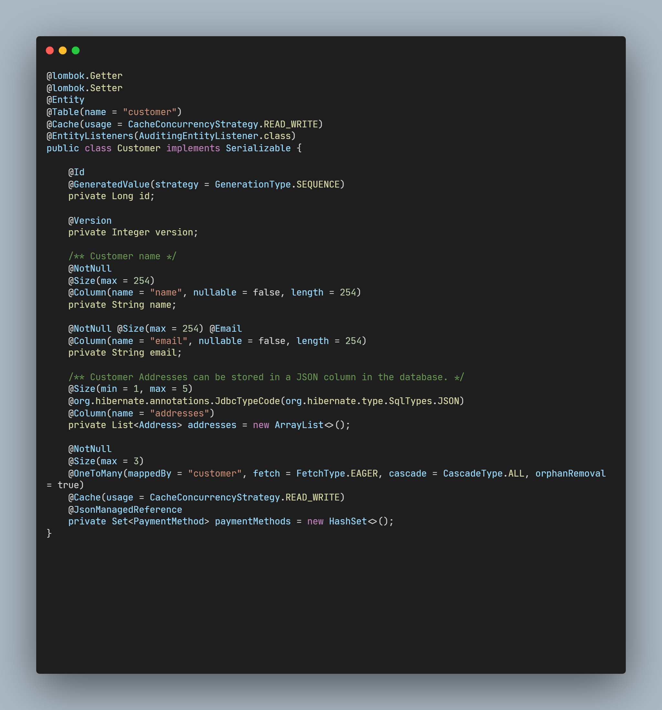
https://github.com/izertis/spring-boot-kotlin-playground/blob/main/customer-address-jpa/src/main/java/com/izertis/example/domain/Customer.java#L23

#### Domain Entity con Data Classes and JPA en Kotlin

Ejemplo equivalente al modelo Java, pero utilizando Kotlin y `data class`:

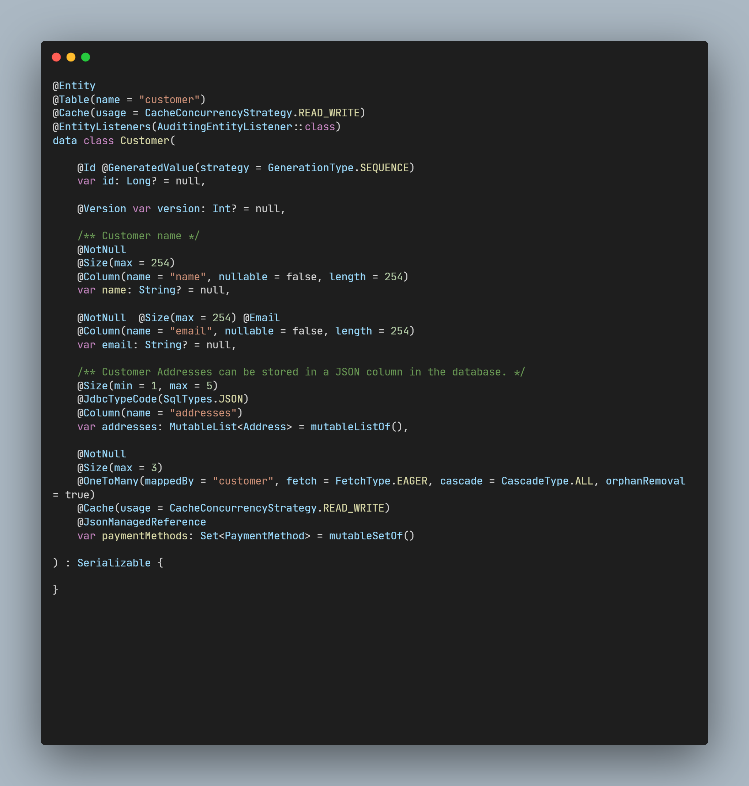
https://github.com/izertis/spring-boot-kotlin-playground/blob/main/kustomer-address-jpa/src/main/kotlin/com/izertis/example/domain/Customer.kt#L21

Con la misma cantidad de código, la entidad de dominio en Kotlin ofrece muchas mas ventajas a la hora de ser invocada en codigo y sin necesidad de librerías externas.

#### Poblando Objetos en Java

Una manera muy practica de evitar variables temporales al instanciar y poblar objeto es utilizar los setters encadenados de Lombok, activados con la propiedad `lombok.accessors.chain=true`, o utilizar el patron Builder de Lombok. Esto da lugar a una sintaxis mas fluida.

El siguiente ejemplo muestra cómo instanciar un objeto Customer, asignar su nombre, email, dirección y métodos de pago mediante setters encadenados:

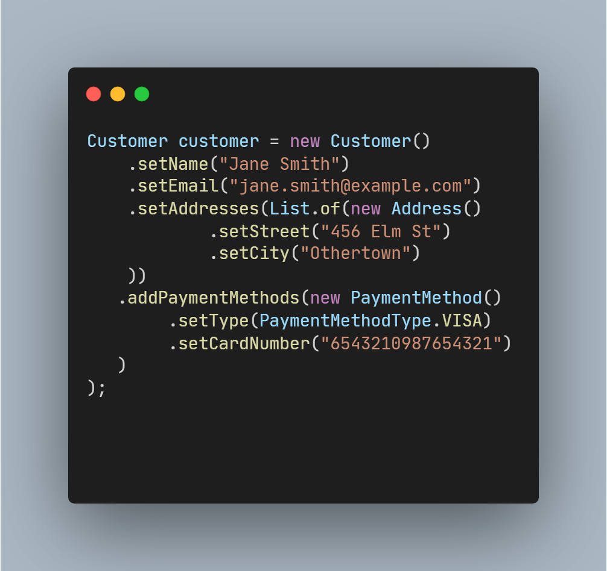

Esta es probablemente la versión mas elegante con API fluida en Java que vamos a utilizar para comparar con distintas opciones en Kotlin.

#### Poblando Objetos en Kotlin

En Kotlin, hay múltiples formas idiomáticas de poblar objetos tipo data class, adaptándose tanto a estilos imperativos como funcionales. Estas opciones permiten un código más expresivo, menos verboso y sin necesidad de librerías externas.

##### Opción 1: Setters

Poblar propiedad a propiedad, similar a utilizar llamadas a setters individuales:

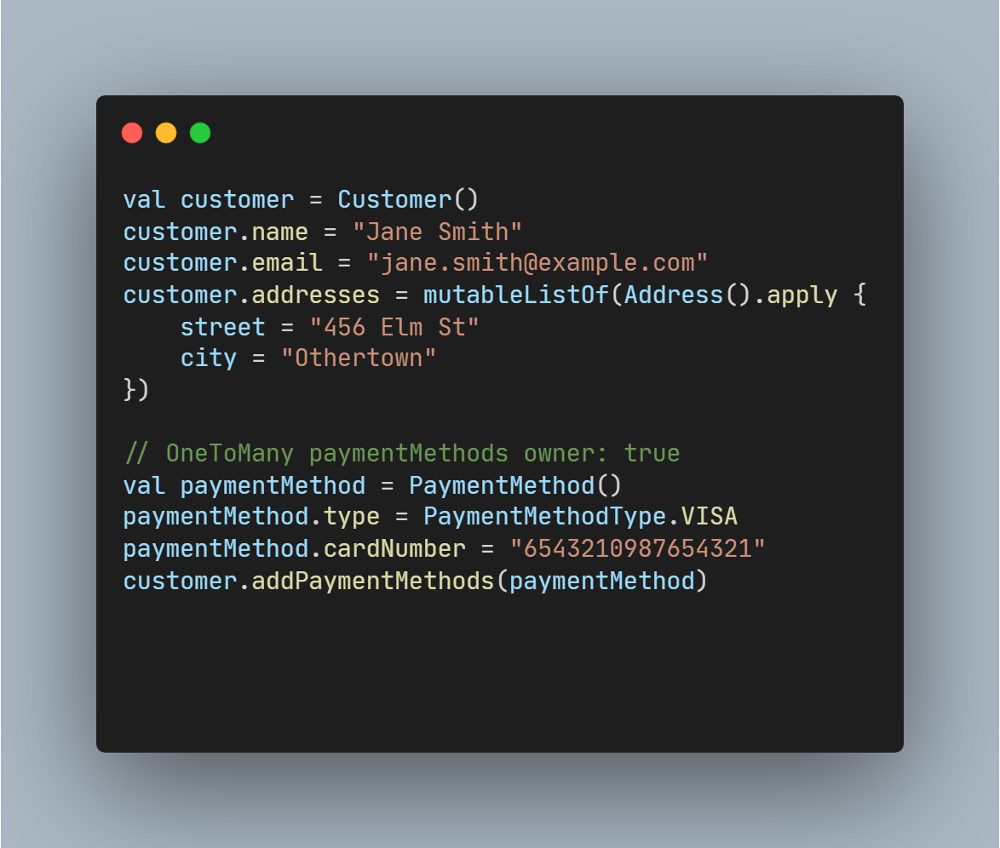

##### Opción 2: Funcion APPLY

Utilizar la función `apply` para poblar el objeto sin variables temporales:

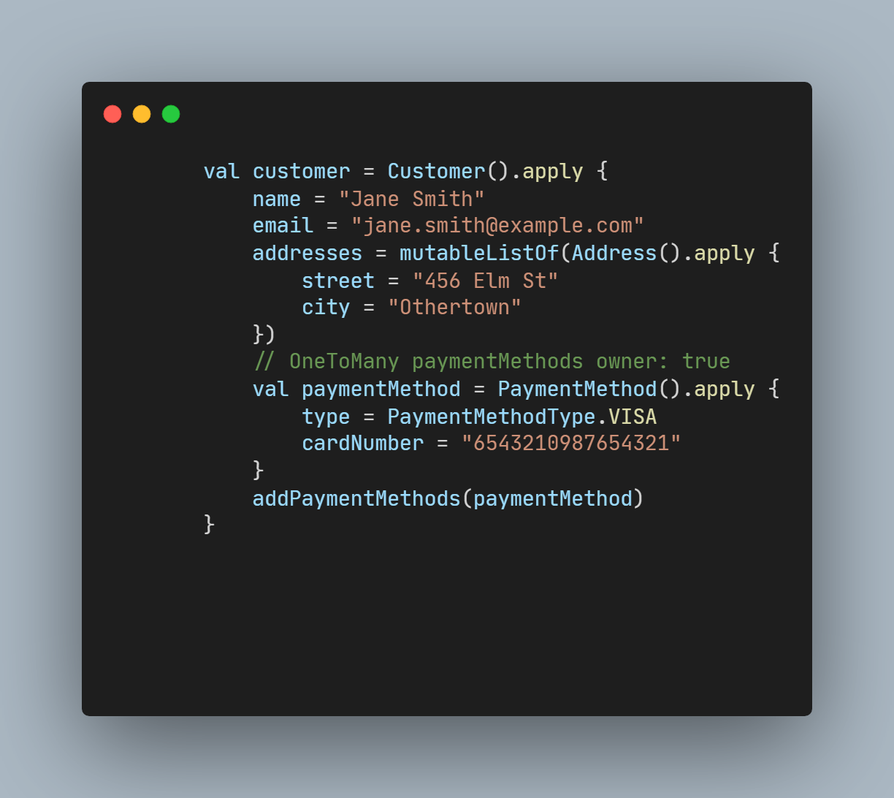

##### Opción 3: Constructor/Builder

Utilizar el constructor de la Data Class, que permite instanciar el objeto con un numero variable de parametros, gracias a la sintaxis de Kotlin que permite nombrar los parametros en la invocacion del constructor

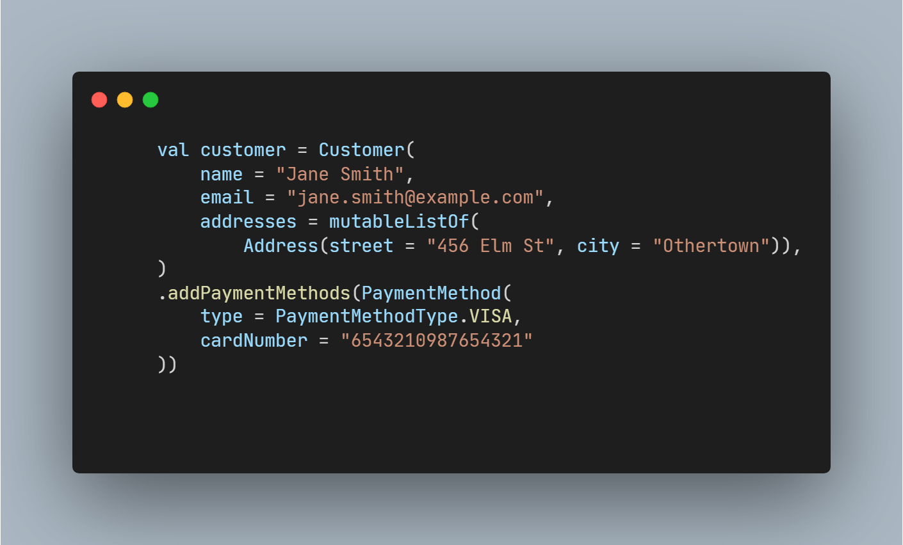

#### Poblando Records de Java

Para comparar, veamos cómo se poblarían objetos usando Java Records, donde a partir de 3 campos comienza a ser difícil saber a qué propiedad corresponde cada valor:

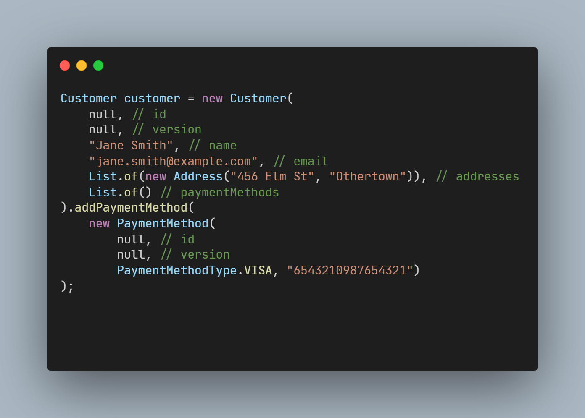

Como se puede observar, los Java Records requieren pasar todos los parámetros en el constructor, ya que son inmutables y no soportan parámetros por defecto, lo que hace el código menos legible y más propenso a errores cuando hay múltiples campos del mismo tipo.

Piensa en cómo sería este código si quitásemos los comentarios. 🤦

### Java Optional vs Kotlin Null Safety

En Kotlin los tipos son **non-nullable por defecto**, esto añade cierta seguridad en tiempo de compilación, ya que cualquier acceso a una propiedad nullable requiere una comprobación explicita.

En Java, ciertas APIs públicas, como por ejemplo Spring-Data, para el manejo de valores nulos se realiza típicamente con `Optional<T>`, mientras que Kotlin ya incorpora null safety directamente en el sistema de tipos.

Esto añade flexibilidad a la hora de consumir estas APIs desde Kotlin, ya que se puede utilizar los metodos fluidos de `Optional` como en Java:

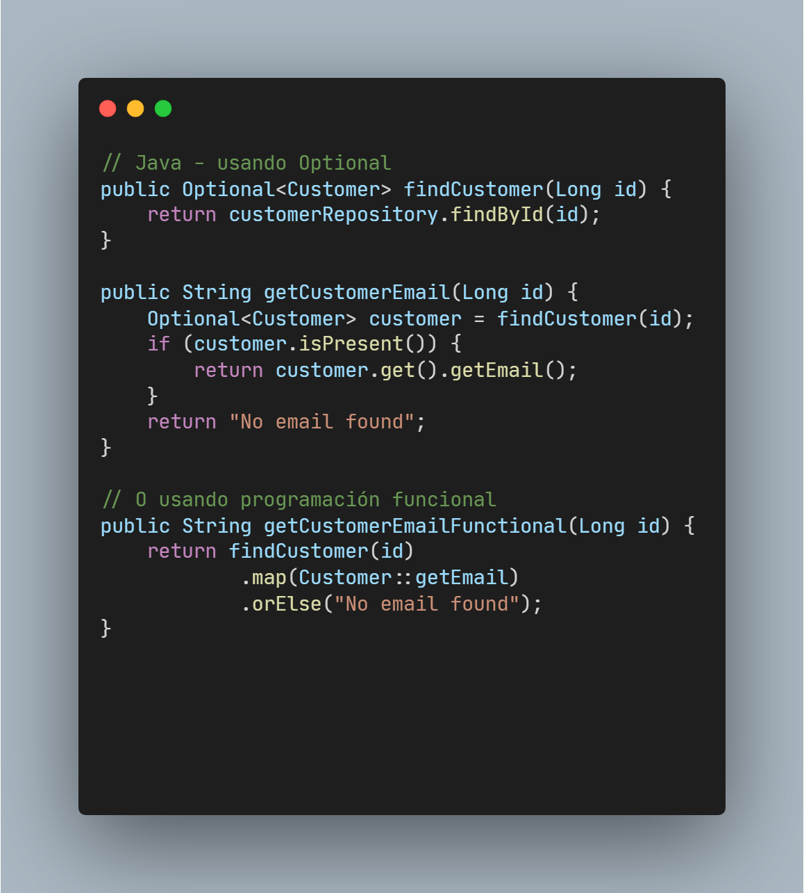

O utilizar las funciones nativas de Kotlin para la concatenacion de llamadas asi como los operadores `?.` y `?:` para la comprobación de nulos:

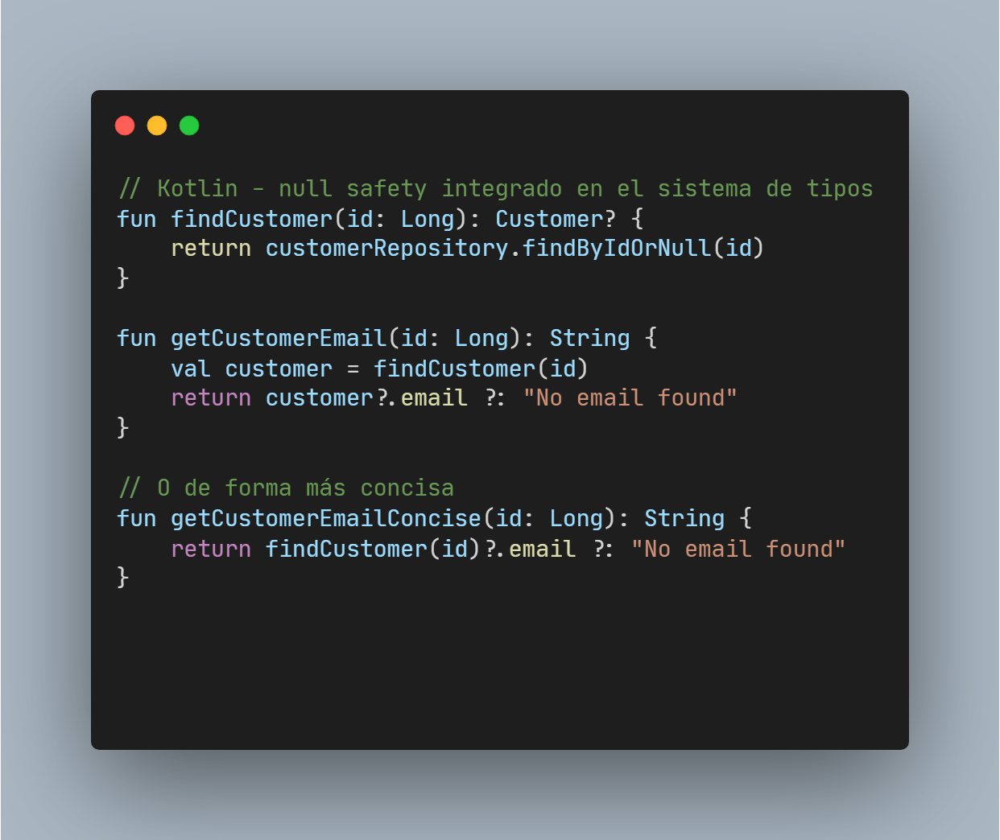

### Optional fluid APIs vs Kotlin fluid APIs

Las APIs fluidas permiten encadenar transformaciones y validaciones de datos sin necesidad de estructuras condicionales explícitas. Tanto Java como Kotlin ofrecen mecanismos para esto, aunque con enfoques distintos:

- Java utiliza Optional con métodos como map(), filter() y orElse().
- Kotlin combina operadores seguros (?., ?:) con funciones de alcance como let, also, apply, etc.

**Ejemplo 1: Capa de servicios**

En Kotlin, el flujo de transformación es fluido, legible y seguro:

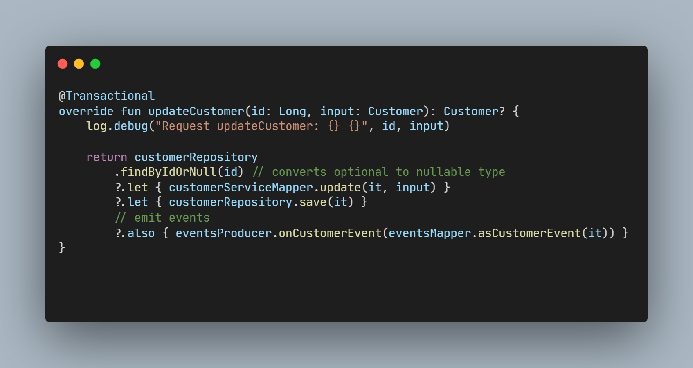

En Java, aunque se puede lograr un flujo similar con Optional, el resultado es algo más verboso y menos directo:

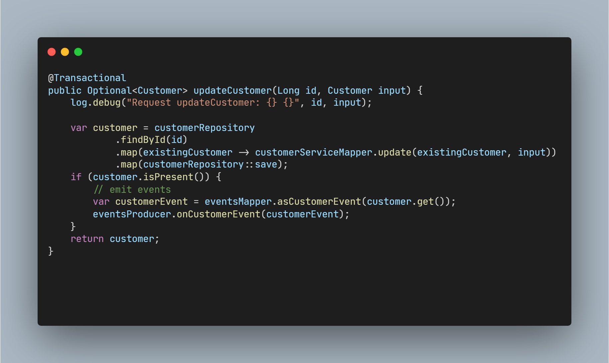

**Ejemplo 2: Capa de controladores**

El enfoque fluido también es muy útil en la capa de controladores para devolver respuestas HTTP en función de la existencia del recurso.

**Kotlin:**

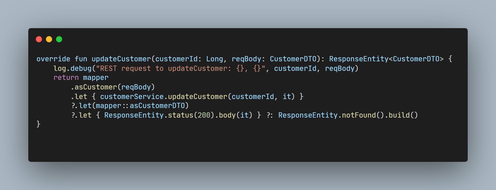

**Java:**

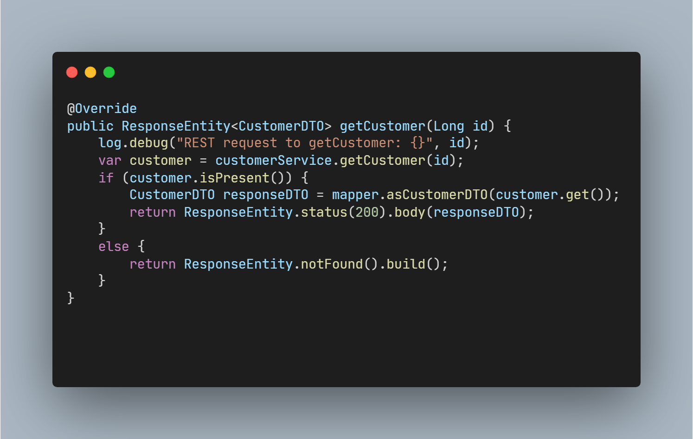

Ambos lenguajes permiten un estilo funcional, pero Kotlin lo facilita de manera más natural y menos verbosa. El uso de operadores nativos y funciones de alcance hace que incluso flujos complejos sean compactos, seguros frente a nulos, y fáciles de leer.

### API Colecciones/Streams Java vs Kotlin

La verbosidad de la API de Streams en Java, junto con la necesidad constante de invocar `stream()` y `collect(...)`, hace que trabajar con colecciones sea más engorroso y menos legible en comparación con Kotlin.

En Java, operar sobre listas requiere encadenar múltiples llamadas y utilizar collectors específicos incluso para operaciones comunes como `map`, `filter` o `groupingBy`.

Kotlin, en cambio, proporciona una API de colecciones mucho más directa y expresiva, con soporte nativo para funciones de orden superior sobre listas, mapas y secuencias, sin necesidad de invocar métodos adicionales ni crear flujos intermedios.

#### Ejemplo en Kotlin

Kotlin proporciona una API de colecciones más expresiva que la de Java, con soporte nativo para funciones de orden superior como `filter`, `map` o `find`. Esto permite construir transformaciones complejas de forma concisa y legible.

Por ejemplo, para obtener una lista de correos electrónicos no nulos de una lista de clientes:

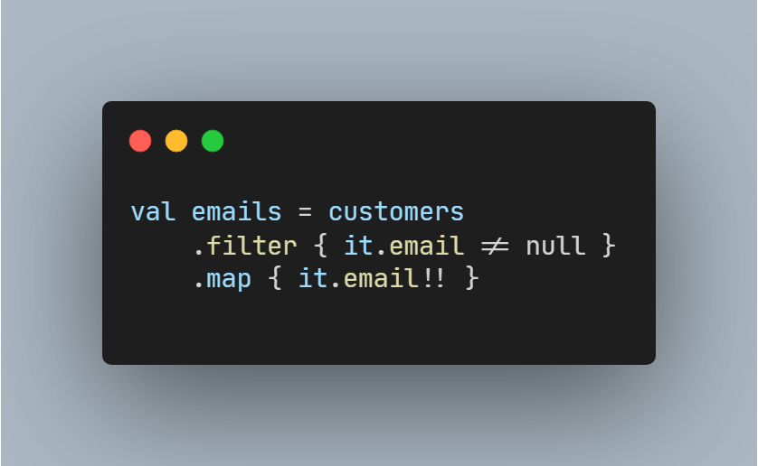

Otro ejemplo típico es el uso de `find` para buscar una coincidencia concreta dentro de una enumeración:


Este enfoque es idiomático en Kotlin y evita la necesidad de bucles explícitos o estructuras auxiliares. La combinación de expresividad, claridad y seguridad ante nulos hace que el trabajo con colecciones sea una de las áreas donde Kotlin brilla especialmente frente a Java.

#### Ejemplo equivalente en Java

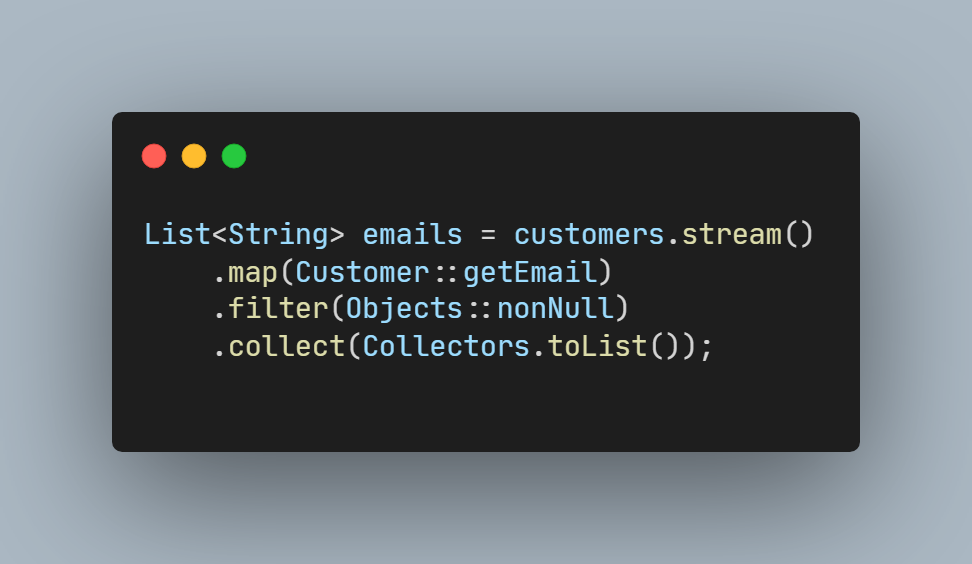

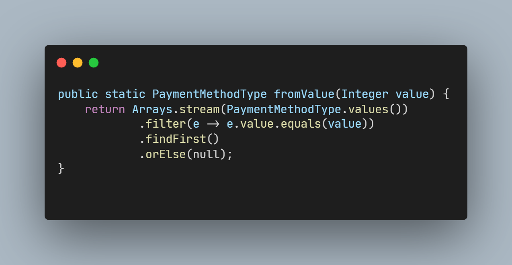

Este ejemplo sencillo ilustra cómo Kotlin reduce el *boilerplate* al mínimo y mejora la legibilidad sin sacrificar funcionalidad. A mayor complejidad en la transformación de datos, mayor será la diferencia en claridad y expresividad entre ambas aproximaciones.

### Interpolación de Strings y Text Blocks

Java introdujo text blocks en Java 13 como preview feature (estabilizado en Java 15) para mejorar el manejo de strings multilínea, mientras que Kotlin ofrece interpolación de strings nativa y más expresiva desde su primera versión.

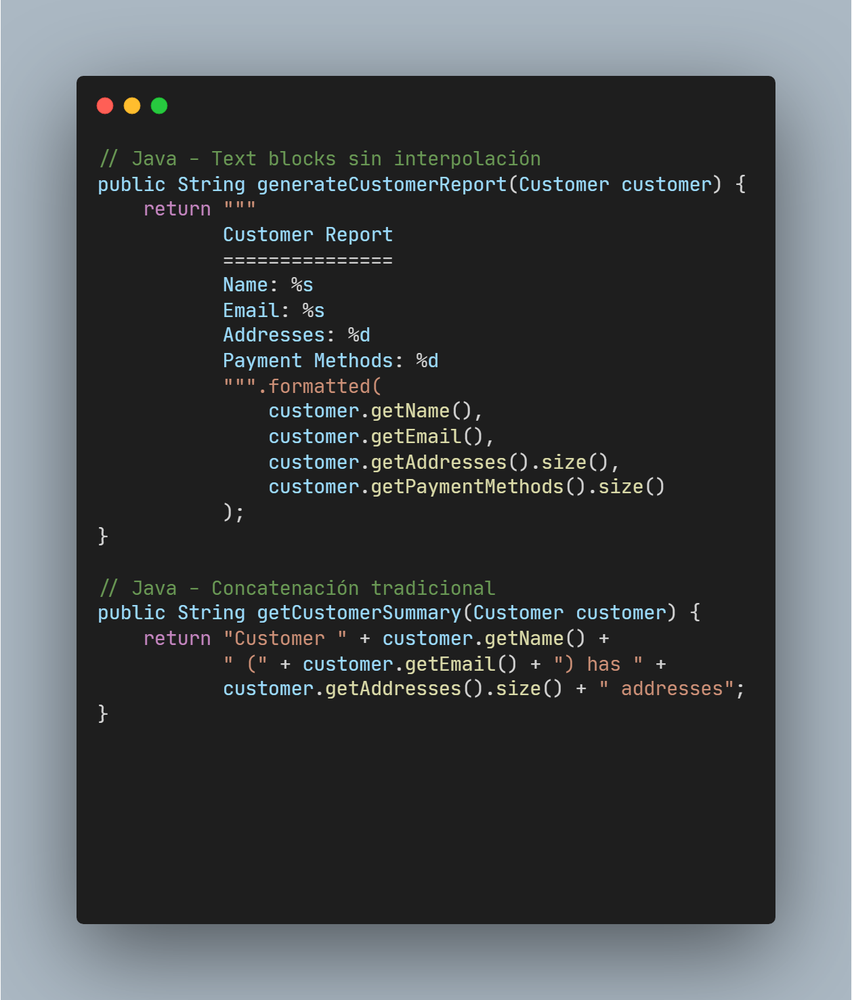

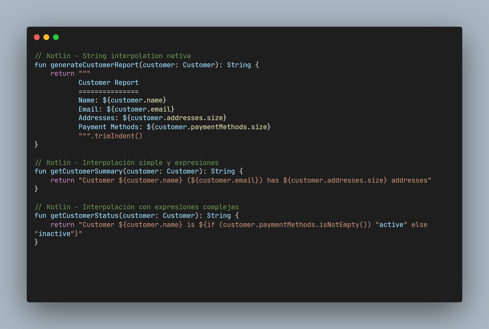

Kotlin permite interpolar variables directamente con `$variable` o expresiones complejas con `${expression}`, eliminando la necesidad de concatenación manual, métodos como `formatted()` o el uso de `StringBuilder`. Esta característica hace que el código sea más legible y menos propenso a errores, especialmente cuando se construyen strings complejos con múltiples variables.

#### Interpolación de Strings en Java 24

Desde Java 24, se ha introducido la interpolación de strings como una preview feature (JEP 459). Esta mejora acerca a Java a la ergonomía que Kotlin ya proporciona, aunque requiere activación explícita del preview para su uso.

**Java 24 – Interpolación nativa (preview):**

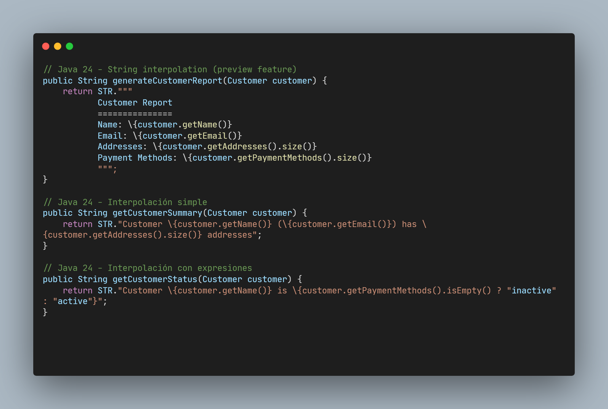

## Conclusiones

Después de analizar en detalle las diferencias entre Java y Kotlin en el contexto de aplicaciones Spring Boot empresariales, podemos extraer las siguientes conclusiones:

- **Sintaxis y expresividad**: Kotlin ofrece una sintaxis más concisa y flexible comparada incluso con versiones recientes de Java, especialmente en el manejo de colecciones, interpolación de strings y APIs fluidas. La reducción del código boilerplate es significativa, lo que se traduce en mayor productividad y código más mantenible.

- **APIs fluidas y DSLs**: Las APIs fluidas de Kotlin, combinadas con funciones de alcance como `apply`, `let` y `run`, permiten crear código tan expresivo que puede sentirse como un DSL o lenguaje de dominio específico. Esto facilita la creación de código declarativo y legible que se acerca al lenguaje natural.

- **Curva de aprendizaje y variabilidad**: La flexibilidad de Kotlin tiene como contrapartida una curva de aprendizaje más pronunciada y una gran variabilidad de implementaciones posibles, con distintos grados de elegancia y legibilidad. Es importante establecer convenciones de equipo para mantener la consistencia del código.

- **Interoperabilidad Java-Kotlin**: La combinación de código Kotlin y Java en un mismo proyecto es totalmente factible y práctica, incluso cuando parte de dicho código es generado por herramientas como OpenAPI Generator, AsyncAPI/ZenWave SDK, Avro Compiler o MapStruct. La configuración adecuada de los procesadores de anotaciones (especialmente Kapt) es clave para el éxito.

- **Soporte en Spring Boot**: El soporte en Spring Boot para Kotlin es muy bueno y maduro, con expectativas de mejora continua para la próxima versión mayor Spring Boot 4, programada para noviembre de 2025. La integración con el ecosistema Spring es prácticamente transparente.

- **Herramientas de build**: Tanto Maven como Gradle ofrecen soporte robusto para proyectos Kotlin, aunque Gradle proporciona una experiencia más nativa y fluida, especialmente con Kotlin DSL para la configuración de build scripts. Sin embargo no hay ninguna necesidad de cambiar de herramienta de build, ya que tanto Maven como Gradle ofrecen un soporte muy bueno para proyectos Kotlin.

En resumen, Kotlin es una opción válida y recomendable para proyectos empresariales de backend, especialmente para aquellos equipos con un nivel de expertise técnico y sensibilidad hacia la elegancia del código, capaces de aprovechar las ventajas sintácticas y funcionales que ofrece Kotlin sin comprometer la mantenibilidad del proyecto.
