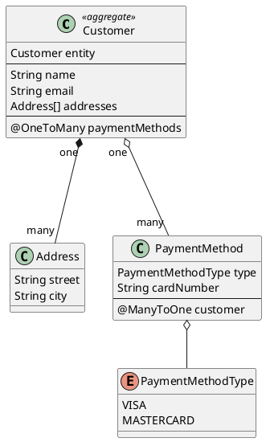
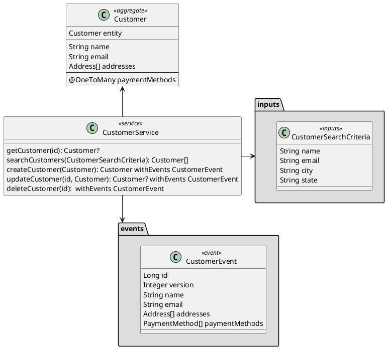

# Desarrollando aplicaciones Spring Boot con Kotlin: Un análisis en profundidad

<!-- TOC -->
* [Desarrollando aplicaciones Spring Boot con Kotlin: Un análisis en profundidad](#desarrollando-aplicaciones-spring-boot-con-kotlin-un-análisis-en-profundidad)
  * [Porque Spring-Boot + Kotlin](#porque-spring-boot--kotlin)
  * [Proyectos Playground](#proyectos-playground)
    * [Stack Tecnologico](#stack-tecnologico)
    * [API-First con OpenAPI Generator](#api-first-con-openapi-generator)
    * [Procesador de anotaciones y MapStruct](#procesador-de-anotaciones-y-mapstruct)
    * [API-First con AsyncAPI (ZenWave SDK)](#api-first-con-asyncapi-zenwave-sdk)
    * [Serializacion de eventos con Avro](#serializacion-de-eventos-con-avro)
  * [Playground Project: Customer/Kustomer API with JPA](#playground-project-customerkustomer-api-with-jpa)
<!-- TOC -->

## Porque Spring-Boot + Kotlin

Aunque las versiones recientes de Java han incorporado mejoras significativas en elegancia, expresividad y concisión (como *records*, *pattern matching*, *sealed classes*, *text blocks* y expresiones *switch* mejoradas), Kotlin destaca por ofrecer una sintaxis más limpia, concisa y expresiva. Esto reduce enormemente el código repetitivo (*boilerplate code*), a la vez que mantiene una interoperabilidad total con Java, lo que lo convierte en una opción interesante para desarrollar aplicaciones modernas con Spring Boot.

Además, Kotlin ofrece características avanzadas que mejoran la productividad y la seguridad del código:
- **Data classes**: Simplifican la creación de clases para modelar datos, reduciendo drásticamente el código repetitivo al generar automáticamente _getters/setters_ y métodos como `toString()`, `equals()`, `hashCode()`, eliminando la necesidad de librerías como Lombok.
- **Null safety**: Los tipos son no nulos por defecto, lo que previene errores de tipo `NullPointerException` en tiempo de compilación, fomentando un código más robusto y seguro.
- **Extension functions**: Permiten extender la funcionalidad de clases existentes sin modificar su código fuente ni recurrir a herencia, mejorando la legibilidad y modularidad.
- **Interpolación de Strings**: Similar a las *text blocks* de Java, pero que permite interpolar (sustituir) variables de manera sencilla y natural.
- **Coroutines**: Facilitan la programación asíncrona al permitir escribir código secuencial y claro, eliminando la complejidad de los callbacks o las cadenas de promesas.

Otros puntos fuertes de Kotlin con respecto a Java incluyen su soporte para programación funcional y APIs fluidas:
- **API de Collections/Streams**: Más concisa y expresiva que la API de Collections de Java, con soporte natural para operaciones funcionales como `map`, `filter` y `reduce`.
- **Funciones de orden superior**: Facilitan la modularidad al permitir pasar funciones como argumentos, promoviendo código reutilizable y declarativo.
- **Funciones de alcance (Scoping Functions)**: Como `let`, `apply`, `with`, `run` y `also`, que junto con operadores de *null safety* como `?.` (operador de navegación segura), `?:` (operador Elvis) y `!!` (operador de aserción no nula), permiten encadenar llamadas, crear ámbitos, evitar variables temporales y simplificar el código, haciéndolo más expresivo y fluido.

Todo esto manteniendo la interoperabilidad con Java de manera bidireccional, cualquier código o librería de Java puede ser invocado desde Kotlin y viceversa.

En resumen, Kotlin ofrece una sintaxis más limpia, concisa y expresiva, mejorando la productividad y la seguridad del código, manteniendo la interoperabilidad con Java, lo que lo convierte en una opción interesante para desarrollar aplicaciones modernas con Spring Boot.

Sin embargo cualquier proyecto empresarial Spring-Boot requiere ademas la integracion con herramientas existentes, como generadores de codigo API-First (OpenAPI, AsyncAPI, Avro), procesadores de anotaciones (MapStruct, Lombok), build tools como Maven o Gradle, y otras integraciones que pueden suponer un desafio si no se tiene en cuenta desde el principio.

Por eso en este articulo hemos decidido crear un proyecto sencillo pero no trivial tanto en Java como en Kotlin y asi poder comparar las dos soluciones.

Ademas el proyecto Kotlin se ha configurado para poder ser construido con Gradle o con Maven indistintamente, para poder comparar las dos soluciones.

## Proyectos Playground

### Stack Tecnologico

- Spring-Boot 3.5.x
- Hibernate
- Spring-Data-JPA
- MapStruct
- OpenAPI Generator
- AsyncAPI Generator (ZenWave SDK)
- Avro + Avro Compiler
- Spring-Cloud-Streams
- Spring-Security

### API-First con OpenAPI Generator

OpenAPI Generator se utiliza para generar las interfaces anotadas de los controladores de Spring MVC y sus DTOs a partir de una definicion OpenAPI, en un fichero `openapi.yml`.

Podemos configurar el plugin para que genere código en Kotlin (usando el generador `kotlin-spring`) o en Java (generador `spring`). Ambas implementaciones son equivalentes en tiempo de ejecución, con solo pequeñas diferencias en tiempo de compilacion: esencialmente tipos `null safety` y `ResponseEntity<Unit>` en lugar de `ResponseEntity<Void>` en el caso de Kotlin.

Sin embargo el hecho de generar codigo Kotlin o Java tiene otras implicaciones, ya que en el codigo de Java, este codigo ha de ser compilador para estar disponible desde el codigo Kotlin. Y es muy probable que los DTOs generados por OpenAPI sean referenciados desde las anotaciones de MapStruct en el codigo Kotlin.

### Procesador de anotaciones y MapStruct

MapStruct es un procesador de anotaciones de Java que genera automáticamente código para mapear objetos (como DTOs a entidades) usando anotaciones como @Mapper y @Mapping. Durante el proceso de compilacion genera el codigo java que implementa dichos mappers, por lo que es eficiente y ligero en tiempo de ejecucion.

Retos:

- Lee anotaciones en classes Kotlin
- Que referencian a clases Java generadas por OpenAPI, AsyncAPI o Avro
- Genera codigo Java
- Que tiene que estar disponible para el resto de codigo Kotlin

Ademas, es necesario configurar el procesador de anotaciones para Kotlin Kapt, en lugar del procesador de anotaciones de Java.

### API-First con AsyncAPI (ZenWave SDK)

ZenWave SDK es una herramienta que permite generar, a partir de una definicion AsyncAPI, en un fichero `asyncapi.yml`, interfaces Java y sus DTOs para producir y consumir eventos, asi como una implementacion completa usando Spring Cloud Stream.

Dado que genera codigo Java, tambien es necesario que este codigo se genere y se ejecute antes del procesador de anotaciones de MapStruct.

### Serializacion de eventos con Avro

Avro es un formato de serializacion de datos, que permite definir esquemas de datos y serializar/deserializar objetos en formato binario. El tamaño de los datos serializados es muy pequeño, y la velocidad de serializacion/deserializacion es alta en comparacion con JSON, y se suele utilizar para serializar eventos en Kafka.

Dado que genera codigo Java, tambien es necesario que este codigo se genere y se ejecute antes del procesador de anotaciones de MapStruct.

Avro cuenta con un plugin de Maven y un CLI por lo que para poder utilizarlo con Gradle es necesario buscar una alternativa.

En nuestro caso hemos utilizado el plugin de Gradle de JBang que permite ejecutar cualquier CLI o metodo `main()` de una libreria Maven.

## Playground Project: Customer/Kustomer API with JPA

El proyecto de ejemplo es una API REST para gestionar el CRUD del _&lt;&lt;aggregate>>_ Customers, que contiene:

- Una colecion de objetos `Address`, que se guardan en BBDD como una columna JSON
- Una colecion de objetos `PaymentMethod` gestionada como una relacion `OneToMany` con JPA/Hibernate
- Un enum `PaymentMethodType` con un conversor custom para persistir como un entero en BBDD

El servicio expone un API REST con los metodos tipicos de un CRUD, asi como un metodo de busqueda paginada.

Ademas cada accion de CRUD genera un evento, que se envia a un bus de eventos (Kafka) para ser consumido por otros microservicios.

Tanto el API REST como el Evento `CustomerEvent` estan definidos en ficheros OpenAPI y AsyncAPI respectivamente, para poder generar codigo con OpenAPI Generator y ZenWave SDK.

### Comparación Java - Kotlin

|                  | Java                      | Kotlin                                  |
|------------------|---------------------------|-----------------------------------------|
| Modelo Datos JPA | POJOs con Lombok          | Data Classes                            |
| Capa de Servicio | APIs fluidas con Optional | APIs fluidas con null safety            |
| REST Controllers |                           | Null safety segun parametros requeridos |

