# Desarrollando aplicaciones Spring Boot con Kotlin: Un análisis en profundidad

<!-- TOC -->
* [Desarrollando aplicaciones Spring Boot con Kotlin: Un análisis en profundidad](#desarrollando-aplicaciones-spring-boot-con-kotlin-un-análisis-en-profundidad)
  * [Porque Spring-Boot + Kotlin](#porque-spring-boot--kotlin)
  * [Playground Project: Customer/Kustomer API with JPA](#playground-project-customerkustomer-api-with-jpa)
    * [Stack Tecnologico](#stack-tecnologico)
    * [API-First con OpenAPI Generator](#api-first-con-openapi-generator)
    * [Procesador de anotaciones y MapStruct](#procesador-de-anotaciones-y-mapstruct)
    * [API-First con AsyncAPI (ZenWave SDK)](#api-first-con-asyncapi-zenwave-sdk)
    * [Serializacion de eventos con Avro](#serializacion-de-eventos-con-avro)
    * [El Proyecto / Modelo](#el-proyecto--modelo)
    * [API First con OpenAPI Generator](#api-first-con-openapi-generator-1)
    * [API First con AsyncAPI (ZenWave SDK)](#api-first-con-asyncapi-zenwave-sdk-1)
    * [Serializacion de eventos con Avro](#serializacion-de-eventos-con-avro-1)
    * [Compilacion con Gradle y Maven](#compilacion-con-gradle-y-maven)
    * [Ejecución](#ejecución)
  * [Comparación Java - Kotlin](#comparación-java---kotlin)
    * [Data Classes vs Lombok](#data-classes-vs-lombok)
    * [Java Optional vs Kotlin Null Safety](#java-optional-vs-kotlin-null-safety)
    * [Optional fluid APIs vs Kotlin fluid APIs](#optional-fluid-apis-vs-kotlin-fluid-apis)
    * [API Coleciones/Streams Java vs Kotlin](#api-colecionesstreams-java-vs-kotlin)
    * [Interpolación de Strings y Text Blocks](#interpolación-de-strings-y-text-blocks)
      * [Interpolación de Strings en Java 24](#interpolación-de-strings-en-java-24)
<!-- TOC -->

## Porque Spring-Boot + Kotlin

Aunque las versiones recientes de Java han incorporado mejoras significativas en elegancia, expresividad y concisión (como *records*, *pattern matching*, *sealed classes*, *text blocks* y expresiones *switch* mejoradas), Kotlin destaca por ofrecer una sintaxis más limpia, concisa y expresiva. Esto reduce enormemente el código repetitivo (*boilerplate code*), a la vez que mantiene una interoperabilidad total con Java, lo que lo convierte en una opción interesante para desarrollar aplicaciones modernas con Spring Boot.

Además, Kotlin ofrece características avanzadas que mejoran la productividad y la seguridad del código:
- **Data classes**: Simplifican la creación de clases para modelar datos, reduciendo drásticamente el código repetitivo al generar automáticamente _getters/setters_ y métodos como `toString()`, `equals()`, `hashCode()`, eliminando la necesidad de librerías como Lombok.
- **Null safety**: Los tipos son no nulos por defecto, lo que previene errores de tipo `NullPointerException` en tiempo de compilación, fomentando un código más robusto y seguro.
- **Extension functions**: Permiten extender la funcionalidad de clases existentes sin modificar su código fuente ni recurrir a herencia, mejorando la legibilidad y modularidad.
- **Interpolación de Strings**: Similar a las *text blocks* de Java, pero que permite interpolar (sustituir) variables de manera sencilla y natural.
- **Coroutines**: Facilitan la programación asíncrona al permitir escribir código secuencial y claro, eliminando la complejidad de los callbacks o las cadenas de promesas.

Otros puntos fuertes de Kotlin con respecto a Java incluyen su soporte para programación funcional y APIs fluidas:
- **API de Collections/Streams**: Más concisa y expresiva que la API de Collections de Java, con soporte natural para operaciones funcionales como `map`, `filter` y `reduce`.
- **Funciones de orden superior**: Facilitan la modularidad al permitir pasar funciones como argumentos, promoviendo código reutilizable y declarativo.
- **Funciones de alcance (Scoping Functions)**: Como `let`, `apply`, `with`, `run` y `also`, que junto con operadores de *null safety* como `?.` (operador de navegación segura), `?:` (operador Elvis) y `!!` (operador de aserción no nula), permiten encadenar llamadas, crear ámbitos, evitar variables temporales y simplificar el código, haciéndolo más expresivo y fluido.

Todo esto manteniendo la interoperabilidad con Java de manera bidireccional, cualquier código o librería de Java puede ser invocado desde Kotlin y viceversa.

En resumen, Kotlin ofrece una sintaxis más limpia, concisa y expresiva, mejorando la productividad y la seguridad del código, manteniendo la interoperabilidad con Java, lo que lo convierte en una opción interesante para desarrollar aplicaciones modernas con Spring Boot.

Sin embargo cualquier proyecto empresarial Spring-Boot requiere ademas la integracion con herramientas existentes, como generadores de codigo API-First (OpenAPI, AsyncAPI, Avro), procesadores de anotaciones (MapStruct, Lombok), build tools como Maven o Gradle, y otras integraciones que pueden suponer un desafio si no se tiene en cuenta desde el principio.

Por eso en este articulo hemos decidido crear un proyecto sencillo pero no trivial tanto en Java como en Kotlin y asi poder comparar las dos soluciones.

Ademas el proyecto Kotlin se ha configurado para poder ser construido con Gradle o con Maven indistintamente, para poder comparar las dos soluciones.

## Playground Project: Customer/Kustomer API with JPA

Ambos proyectos playground implementan la misma funcionalidad en Java y Kotlin, usando los mismos principios y herramientas, para poder compararlas.

- "Customer with Address and Payment Methods" con JPA en Java: https://github.com/izertis/spring-boot-kotlin-playground/tree/main/customer-address-jpa
- "Kustomer with Address and Payment Methods" con JPA en Kotlin: https://github.com/izertis/spring-boot-kotlin-playground/tree/main/kustomer-address-jpa

### Stack Tecnologico

Hemos elegido un stack tecnologico simple pero completo, que puede servir como base solida para cualquier microservicio empresarial moderno:

- Spring-Boot 3.5.x
- Hibernate
- Spring-Data-JPA
- MapStruct / Lombok
- OpenAPI Generator
- AsyncAPI Generator (ZenWave SDK)
- Avro + Avro Compiler
- Spring-Cloud-Streams
- Spring-Security
- TestContainers con Docker Compose

### API-First con OpenAPI Generator

OpenAPI Generator se utiliza para generar las interfaces anotadas de los controladores de Spring MVC y sus DTOs a partir de una definicion OpenAPI, en un fichero `openapi.yml`.

Podemos configurar el plugin para que genere código en Kotlin (usando el generador [kotlin-spring](https://openapi-generator.tech/docs/generators/kotlin-spring/)) o en Java (generador [spring](https://openapi-generator.tech/docs/generators/spring/)). Ambas implementaciones son equivalentes en tiempo de ejecución, con solo pequeñas diferencias en tiempo de compilacion: esencialmente tipos `null safety` y `ResponseEntity<Unit>` en lugar de `ResponseEntity<Void>` en el caso de Kotlin.

Sin embargo el hecho de generar codigo Kotlin o Java tiene otras implicaciones, ya que en el codigo de Java, este codigo ha de ser compilador para estar disponible desde el codigo Kotlin. Y es muy probable que los DTOs generados por OpenAPI sean referenciados desde las anotaciones de MapStruct en el codigo Kotlin.

Hemos configurado OpenAPI generator con Maven para ambos proyectos y adicionalmente con Gradle para el proyecto Kotlin:

- OpenAPI Generator con Maven para Java: https://github.com/izertis/spring-boot-kotlin-playground/blob/main/customer-address-jpa/pom.xml#L293
- OpenAPI Generator con Maven para Kotlin: https://github.com/izertis/spring-boot-kotlin-playground/blob/main/kustomer-address-jpa/pom.xml#L312
- OpenAPI Generator con Gradle para Kotlin: https://github.com/izertis/spring-boot-kotlin-playground/blob/main/kustomer-address-jpa/build.gradle.kts#L119

### Procesador de anotaciones y MapStruct

MapStruct es un procesador de anotaciones de Java que genera automáticamente código para mapear objetos (como DTOs a entidades) usando anotaciones como `@Mapper` y `@Mapping`. Durante el proceso de compilacion genera el codigo java que implementa dichos mappers, por lo que es eficiente y ligero en tiempo de ejecucion.

Aunque podria parecer una eleccion sencilla, presenta retos importantes para funcionar correctamente en projectos Kotlin, ya que:

- Lee anotaciones en classes Kotlin
- Que referencian a clases Java generadas por OpenAPI, AsyncAPI o Avro
- Genera codigo Java
- Que tiene que estar disponible para el resto de codigo Kotlin

Ademas, es necesario configurar el procesador de anotaciones para Kotlin **Kapt**, en lugar del procesador de anotaciones de Java.

### API-First con AsyncAPI (ZenWave SDK)

[ZenWave SDK](https://www.zenwave360.io/zenwave-sdk/plugins/asyncapi-spring-cloud-streams3/) es una herramienta que permite generar, a partir de una definicion AsyncAPI, en un fichero `asyncapi.yml`, interfaces Java y sus DTOs para producir y consumir eventos, asi como una implementacion completa usando Spring Cloud Stream.

Funciona de una manera similar a OpenAPI Generator, pero para AsyncAPI, generando un wrapper muy ligero al rededor de Spring Cloud Stream.

Dado que genera codigo Java, tambien es necesario que este codigo se genere y se ejecute antes del procesador de anotaciones de MapStruct.

Tambien hemos configurado ZenWave SDK generator con Maven para ambos proyectos y adicionalmente con Gradle para el proyecto Kotlin:

- ZenWave SDK Generator con Maven para Java: https://github.com/izertis/spring-boot-kotlin-playground/blob/main/customer-address-jpa/pom.xml#L343
- ZenWave SDK Generator con Maven para Kotlin: https://github.com/izertis/spring-boot-kotlin-playground/blob/main/kustomer-address-jpa/pom.xml#L363
- ZenWave SDK Generator con Gradle para Kotlin: https://github.com/izertis/spring-boot-kotlin-playground/blob/main/kustomer-address-jpa/build.gradle.kts#L145

Para el caso de Gradle hemos utilizado el plugin de Gradle de JBang que permite ejecutar cualquier CLI o metodo `main()` de cualquier libreria publicada en Maven Central.

### Serializacion de eventos con Avro

[Avro](https://avro.apache.org/docs/1.12.0/getting-started-java/) es un formato de serializacion de datos, que permite definir esquemas de datos y serializar/deserializar objetos en formato binario. El tamaño de los datos serializados es muy pequeño, y la velocidad de serializacion/deserializacion es alta en comparacion con JSON, y se suele utilizar para serializar eventos en Kafka.

Dado que genera codigo Java, tambien es necesario que este codigo se genere y se ejecute antes del procesador de anotaciones de MapStruct.

Tambien hemos configurado Avro Compiler con Maven para ambos proyectos y adicionalmente con Gradle para el proyecto Kotlin:

- Avro Compiler con Maven para Java: https://github.com/izertis/spring-boot-kotlin-playground/blob/main/customer-address-jpa/pom.xml#L406
- Avro Compiler con Maven para Kotlin: https://github.com/izertis/spring-boot-kotlin-playground/blob/main/kustomer-address-jpa/pom.xml#L426
- Avro Compiler con Gradle para Kotlin: https://github.com/izertis/spring-boot-kotlin-playground/blob/main/kustomer-address-jpa/build.gradle.kts#L169

**NOTA:** Dado que hasta la version 1.12.0 de Avro, el orden en que se definen los ficheros de Avro es muy importante para respetar las dependencias entre schemas, hemos decidido utilizar la version 1.11.1 que es una version muy extendida para ilustrar esta cuestion.


### El Proyecto / Modelo

El proyecto de ejemplo es una API REST para gestionar el CRUD del _&lt;&lt;aggregate>>_ Customers, que contiene:

- Una colecion de objetos `Address`, que se guardan en BBDD como una columna JSON
- Una colecion de objetos `PaymentMethod` gestionada como una relacion `OneToMany` con JPA/Hibernate
- Un enum `PaymentMethodType` con un conversor custom para persistir como un entero en BBDD

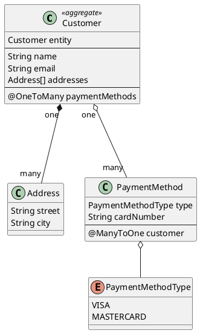
```plantuml
@startuml
class Customer << aggregate >> {
Customer entity
--
String name
String email
Address[] addresses
--
@OneToMany paymentMethods
}

Customer "one" *--down- "many" Address
class Address  {
String street
String city
}

Customer "one" o--down- "many" PaymentMethod
class PaymentMethod  {
PaymentMethodType type
String cardNumber
--
@ManyToOne customer
}

PaymentMethod o-- PaymentMethodType
enum PaymentMethodType  {
VISA
MASTERCARD
}

@enduml
```

El servicio expone un API REST con los metodos tipicos de un CRUD, asi como un metodo de busqueda paginada.

Ademas cada accion de CRUD genera un evento, que se envia a un bus de eventos (Kafka) para ser consumido por otros microservicios.

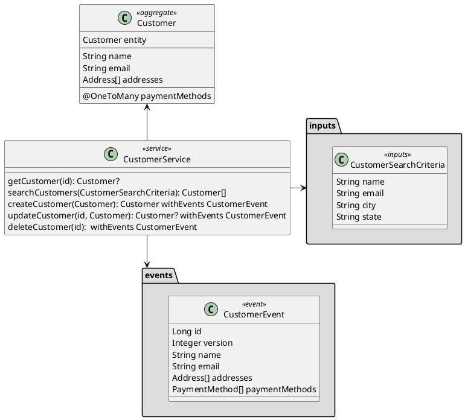
```plantuml
@startuml

CustomerService -up-> Customer
class Customer << aggregate >> {
    Customer entity
    --
    String name
    String email
    Address[] addresses
    --
    @OneToMany paymentMethods
}


class CustomerService  << service >> {
    getCustomer(id): Customer? 
    searchCustomers(CustomerSearchCriteria): Customer[] 
    createCustomer(Customer): Customer withEvents CustomerEvent
    updateCustomer(id, Customer): Customer? withEvents CustomerEvent
    deleteCustomer(id):  withEvents CustomerEvent
}

CustomerService -left-> inputs
namespace inputs #DDDDDD {
    class CustomerSearchCriteria << inputs >> {
        String name
        String email
        String city
        String state
    }
}


CustomerService -down-> events
namespace events #DDDDDD {
    class CustomerEvent << event >> {
        Long id
        Integer version
        String name
        String email
        Address[] addresses
        PaymentMethod[] paymentMethods
    }
}

@enduml
```

Tanto el API REST como el Evento `CustomerEvent` estan definidos en ficheros OpenAPI y AsyncAPI respectivamente, para poder generar codigo con OpenAPI Generator y ZenWave SDK.

### Ejecución

Ambos proyectos pueden ser arrancados desde el IDE ejecutando la classe `Application` con el prefil `local` o desde la linea de comandos con Maven o Gradle:

```bash
mvn spring-boot:run -Dspring-boot.run.profiles=local
```

```bash
./gradlew bootRun --args='--spring.profiles.active=local'
```

Recuerda antes de arrancar el codigo del projecto levantar las dependencias con Docker Compose:

```bash
docker-compose -f docker-compose.yml up -d
```

### APIs Publicas

Las APIs publicas definidas en OpenAPI/AsyncAPI/Avro son identicas entre ambos proyectos y puedes encontrarlas en los siguientes enlaces:

- Proyecto Java:
  - OpenAPI: https://github.com/izertis/spring-boot-kotlin-playground/blob/main/customer-address-jpa/src/main/resources/public/apis/openapi.yml
  - AsyncAPI: https://github.com/izertis/spring-boot-kotlin-playground/blob/main/customer-address-jpa/src/main/resources/public/apis/asyncapi.yml
  - Avro: https://github.com/izertis/spring-boot-kotlin-playground/tree/main/customer-address-jpa/src/main/resources/public/apis/avro

- Proyecto Kotlin:
  - OpenAPI: https://github.com/izertis/spring-boot-kotlin-playground/blob/main/kustomer-address-jpa/src/main/resources/public/apis/openapi.yml
  - AsyncAPI: https://github.com/izertis/spring-boot-kotlin-playground/blob/main/kustomer-address-jpa/src/main/resources/public/apis/asyncapi.yml
  - Avro: https://github.com/izertis/spring-boot-kotlin-playground/tree/main/kustomer-address-jpa/src/main/resources/public/apis/avro

En el caso de las APIs REST puedes acceder a la interfaz de Swagger en la siguiente URL:

- Java: http://localhost:8080/swagger-ui/index.html
- Kotlin: http://localhost:8081/swagger-ui/index.html

## Comparación Java - Kotlin

### Data Classes vs Lombok

* Java

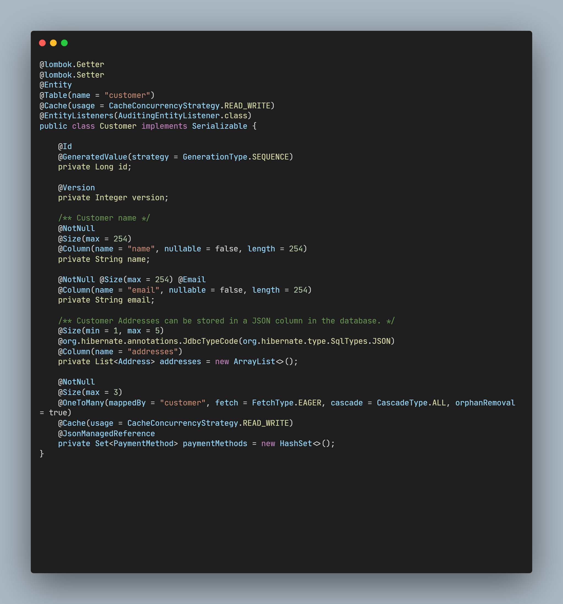
https://github.com/izertis/spring-boot-kotlin-playground/blob/main/customer-address-jpa/src/main/java/com/izertis/example/domain/Customer.java#L23

* Kotlin

* Kotlin

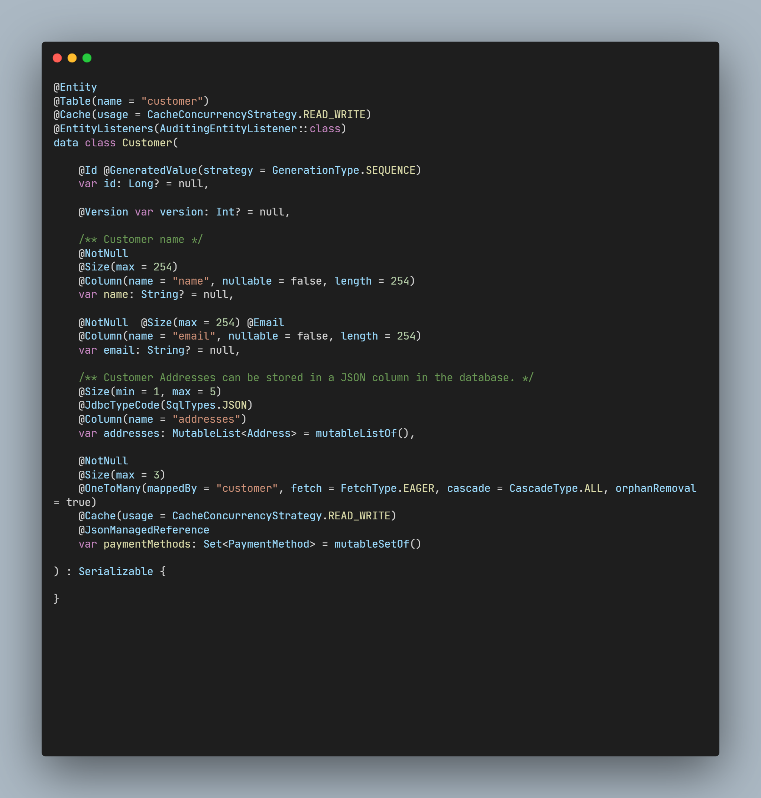
https://github.com/izertis/spring-boot-kotlin-playground/blob/main/kustomer-address-jpa/src/main/kotlin/com/izertis/example/domain/Customer.kt#L21

* Poblando Objetos en Java

`lombok.accessors.chain=true`

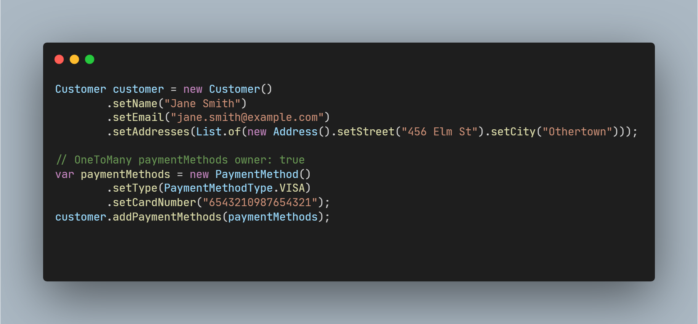

* Poblando Objetos en Kotlin

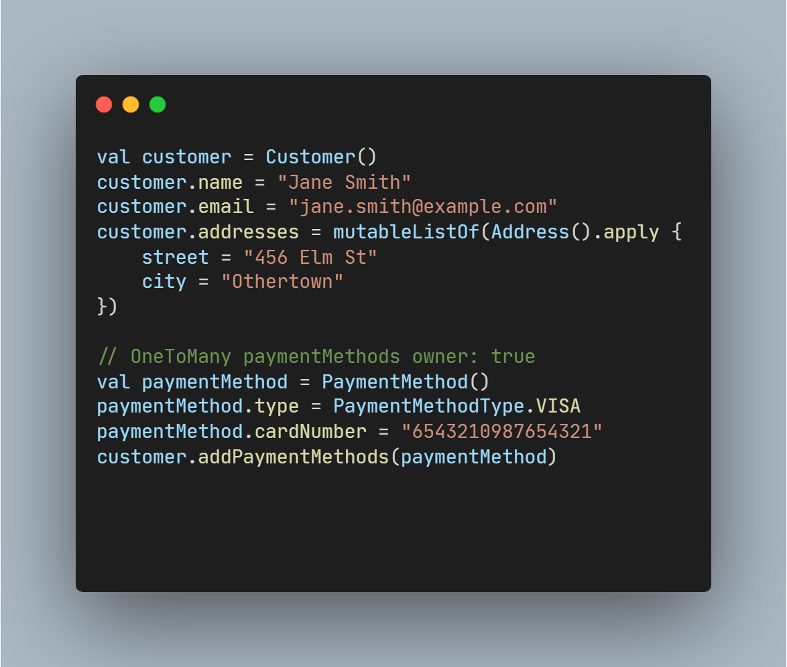

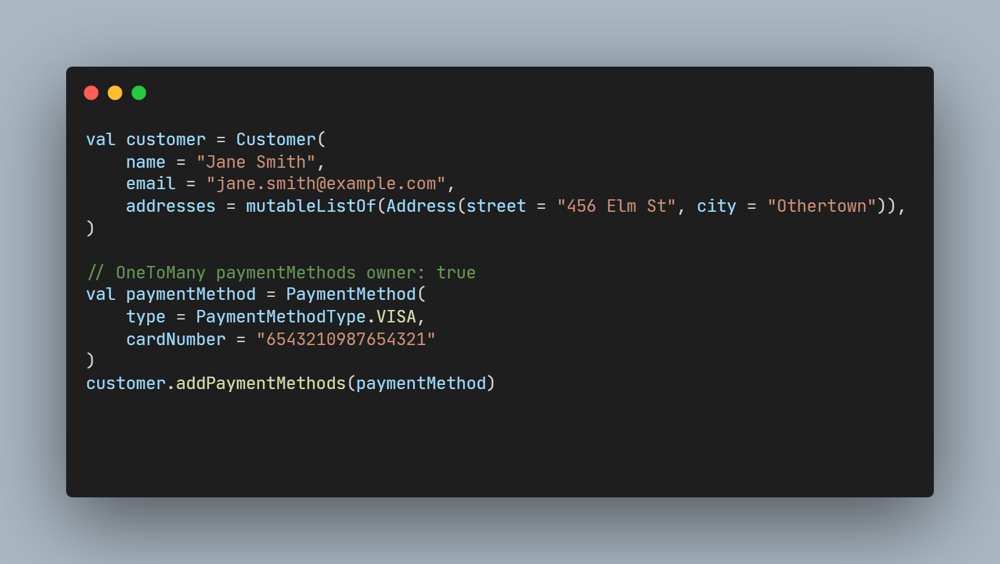

* Poblando Objetos en Java con Records

Comparar con records en Java, donde a partir de 3 campos comienza a ser dificil saber a que propiedad corresponde cada valor.


### Java Optional vs Kotlin Null Safety

En Java, el manejo de valores nulos se realiza típicamente con `Optional<T>`, mientras que Kotlin incorpora null safety directamente en el sistema de tipos.

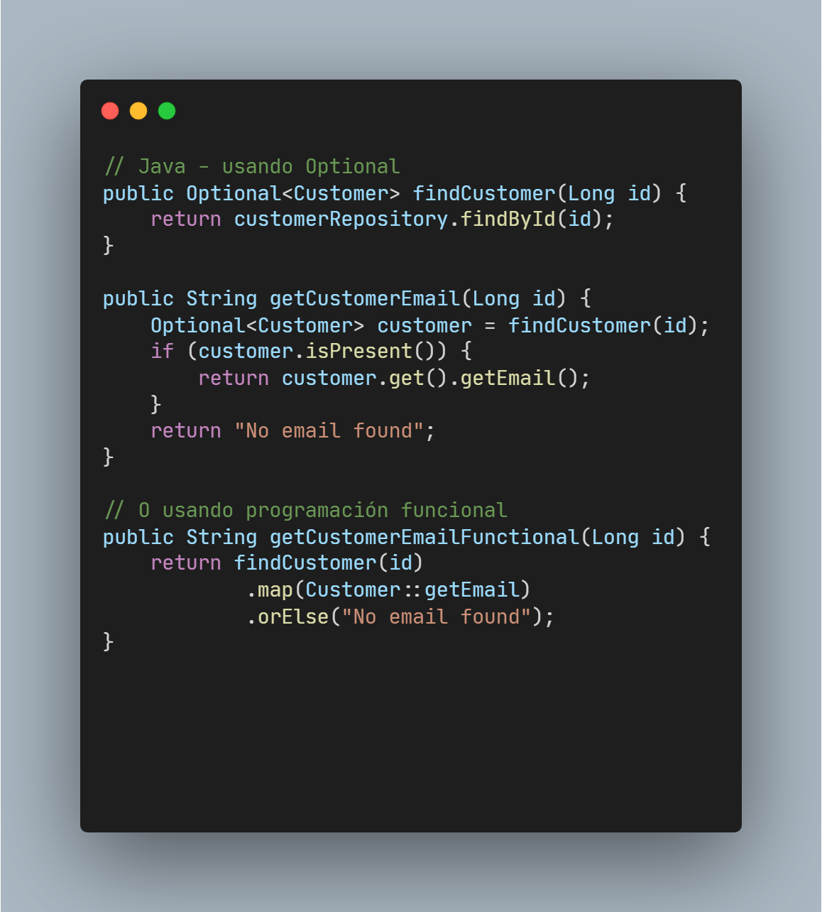

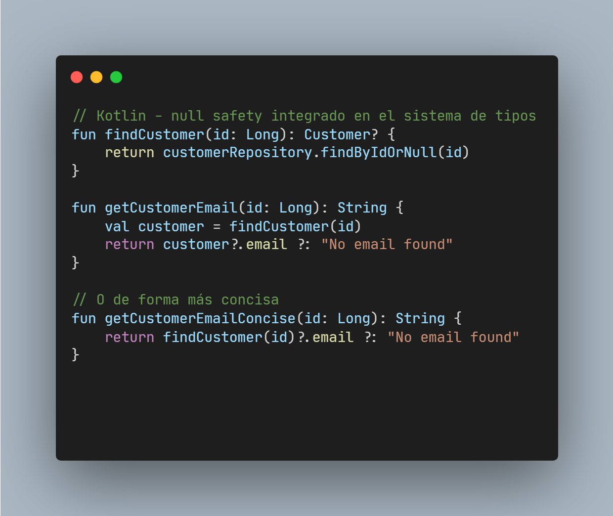

En Kotlin, los tipos nullable (`Customer?`) y non-nullable (`Customer`) están diferenciados a nivel de compilador, eliminando la necesidad de `Optional` y proporcionando mayor seguridad en tiempo de compilación.

### Optional fluid APIs vs Kotlin fluid APIs


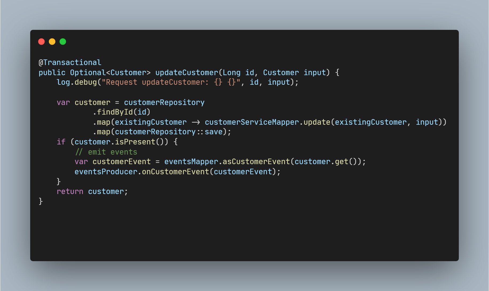

Otro ejemplo en la capa de controllers

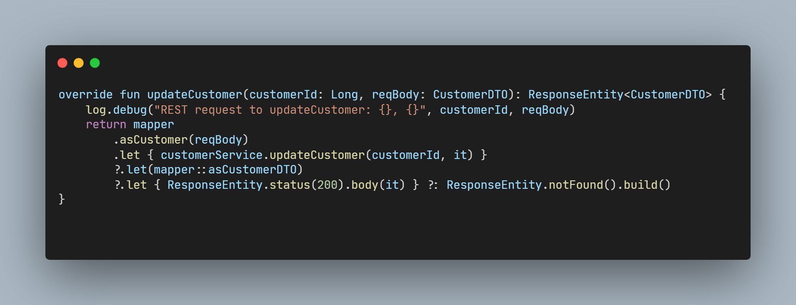

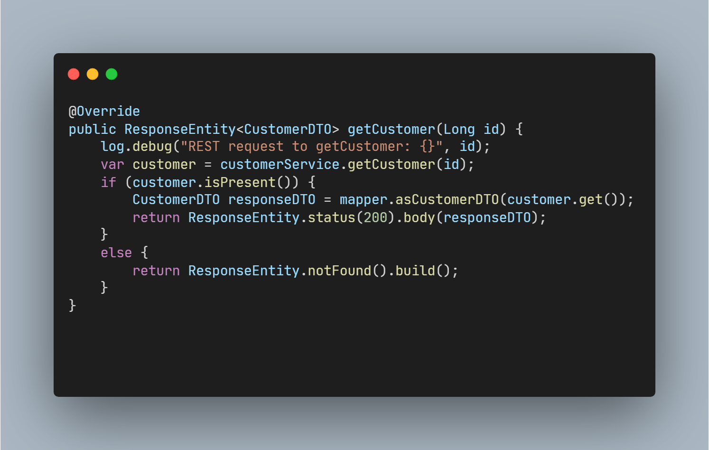


### API Coleciones/Streams Java vs Kotlin

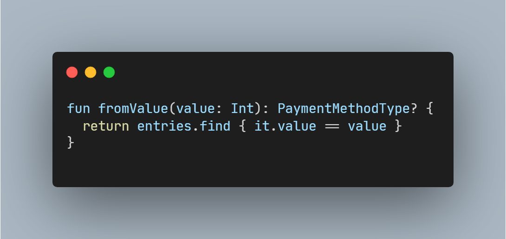


### Interpolación de Strings y Text Blocks

Java introdujo text blocks en versiones recientes, mientras que Kotlin ofrece interpolación de strings nativa y más expresiva.

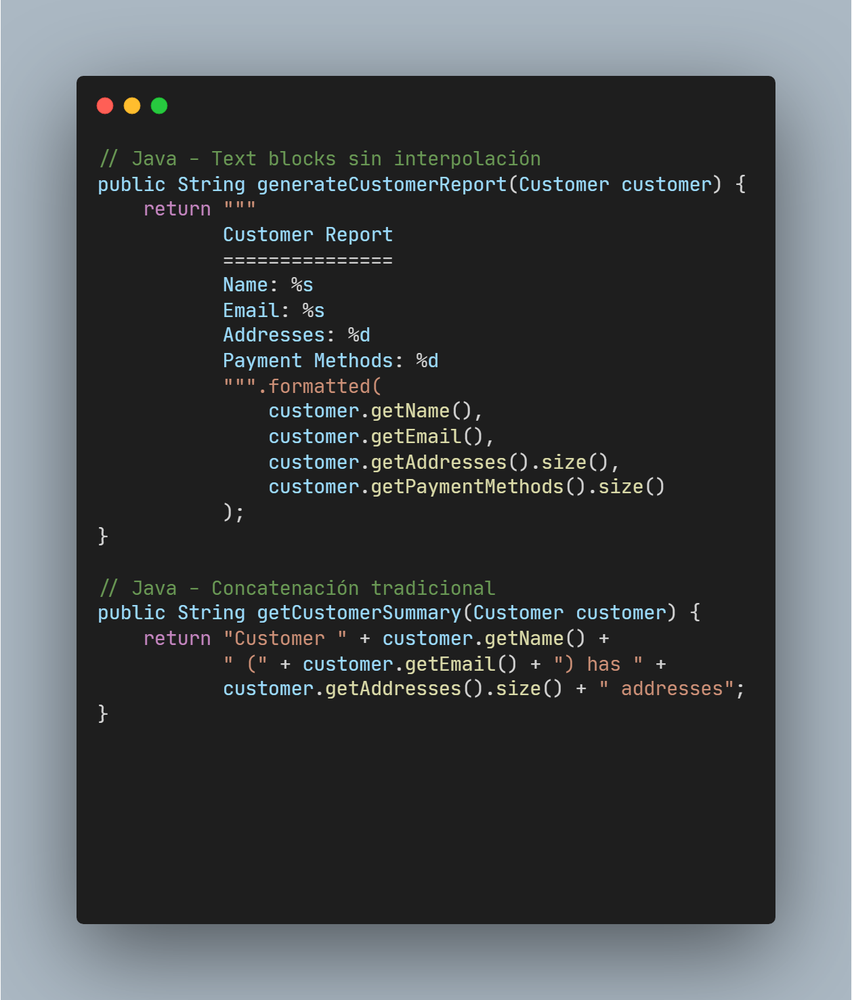

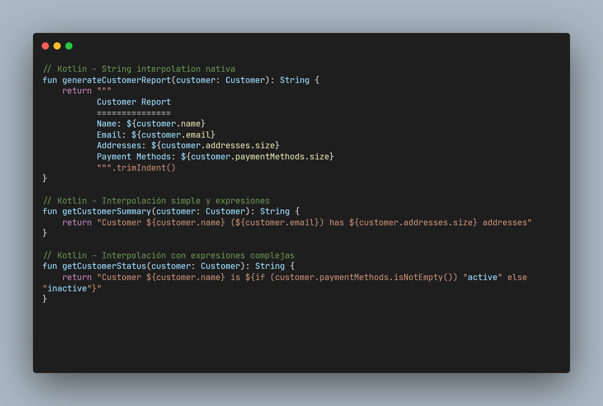

Kotlin permite interpolar variables directamente con `$variable` o expresiones complejas con `${expression}`, eliminando la necesidad de concatenación manual o métodos como `formatted()`.

#### Interpolación de Strings en Java 24

Java 24 introduce string interpolation como preview feature, mientras que Kotlin ya ofrece interpolación de strings nativa y madura.

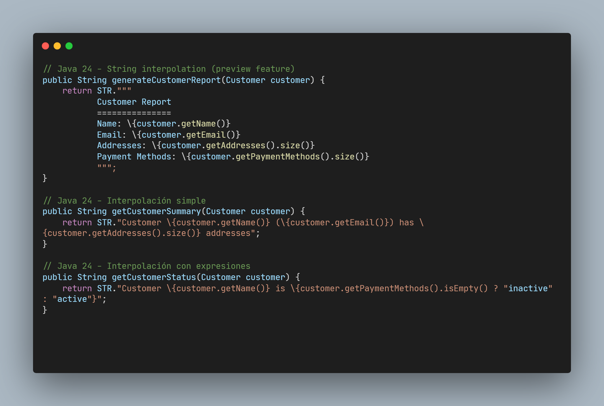

Java 24 introduce el template processor `STR` con sintaxis `\{expression}`, pero aún es una preview feature. Kotlin ofrece interpolación madura con `$variable` y `${expression}` desde su primera versión.

